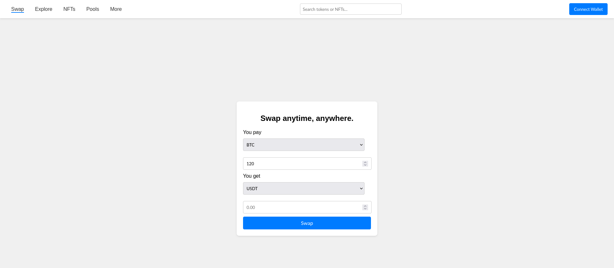

# Bitswap Interface ⚡ 💱

Interface for Bitswap -- a protocol for decentralized exchange of RGB Assets

**⚠️Alpha software and WIP**

## Preview

## Roadmap

- [x] Design UI for Web DEX
- [ ] UX
- [ ] Bitmask
- [ ] Other wallets
- [ ] Integration with Bitswap Core (dev internal)
- [ ] Release web page in beta

